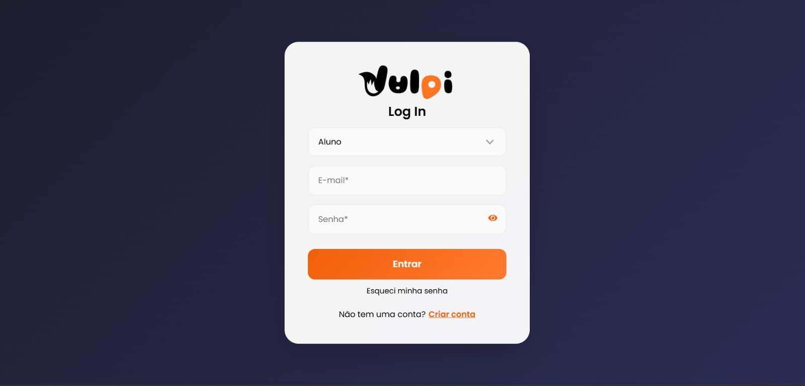
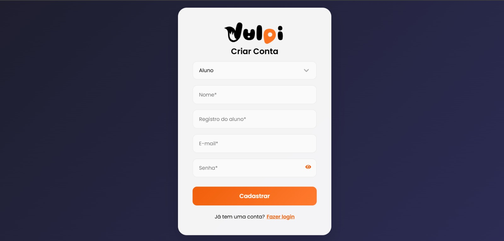
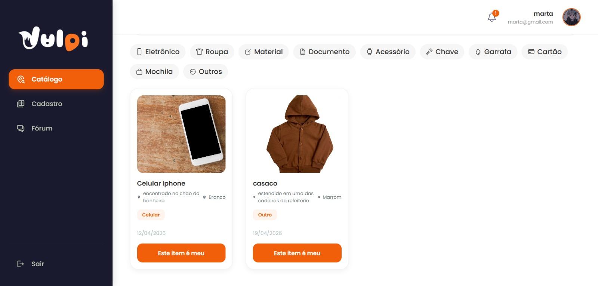
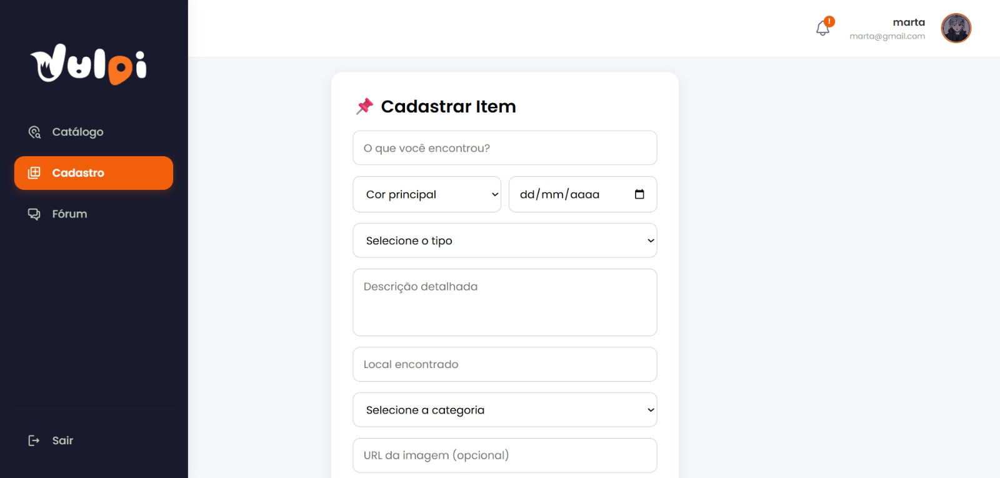
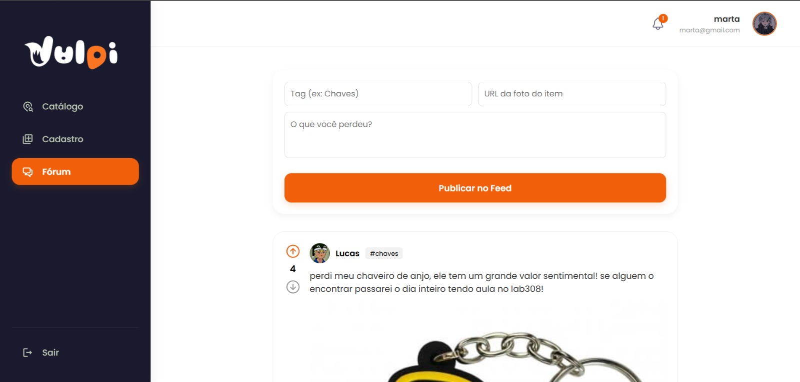
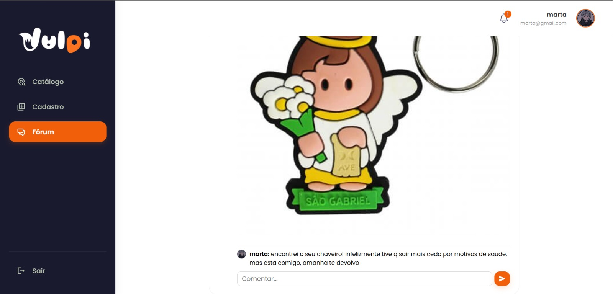

# `VULPI: Sistema Colaborativo de Achados e Perdidos (WEB)`

> **Protótipo Independente de Estudo**: Desenvolvido em colaboração para fins de aprendizado e aprimoramento técnico.

Este repositório contém o código-fonte da **Plataforma Web** do protótipo Vulpi. Desenvolvida com React e Vite, a aplicação utiliza o ecossistema Firebase para conectar usuários em uma rede de auxílio mútuo, facilitando a devolução de itens perdidos. O nome "Vulpi" remete à raposa (do latim *Vulpes*), símbolo de inteligência e agilidade.

---

## 💡 `Sobre o Projeto`

O Vulpi nasceu como um protótipo colaborativo entre dois amigos e estudantes de tecnologia. O objetivo principal foi aplicar na prática conceitos avançados de desenvolvimento Web e Backend, criando uma solução real para o problema comum de perda de objetos em ambientes acadêmicos.

Neste projeto, focamos em:
* **Colaboração Remota:** Trabalho em equipe utilizando versionamento e divisão de tarefas.
* **Transparência:** Um catálogo visual e filtrável de itens encontrados, permitindo a reivindicação direta.
* **Aprendizado Prático:** Implementação de fluxos complexos como autenticação real e gerenciamento de estados no React.

---

## 💻 `Telas Principais`

| Tela de Login | Cadastro de Usuários |
| :---: | :---: |
|  |  | 

| Catálogo de Achados |Cadastro de Itens Encontrados |
| :---: | :---: |
|  |  | 

| Fórum da Comunidade | Fórum da Comunidade |
| :---: | :---: |
|  |  |

---

## 🛠️ `Stack Tecnológica`

| Camada | Tecnologia | Descrição |
| :--- | :--- | :--- |
| **Interface Web** | React JS | Biblioteca para construção de interfaces reativas. |
| **Ferramenta de Build** | Vite | Ferramenta moderna que oferece uma experiência de desenvolvimento rápida. |
| **Estilização** | CSS-in-JS | Gerenciamento de estilos via JavaScript para maior controle dinâmico. |
| **Backend/DB** | Firebase | Autenticação (Auth) e Banco de Dados NoSQL em tempo real (Firestore). |

---

## 🔔 `Funcionalidades Implementadas`

| Funcionalidade | Descrição |
| :--- | :--- |
| **Fórum (Feed Social)** | Sistema de postagens com suporte a fotos, tags, comentários e votos. |
| **Catálogo Dinâmico** | Busca e filtragem avançada por categorias de itens achados. |
| **Gestão de Perfil** | Edição de informações pessoais com persistência de dados no Firestore. |

---

## 👤 `Desenvolvedores`

Este projeto é fruto da colaboração entre:

* **Julia Franco**
* **Lucas Santos**
